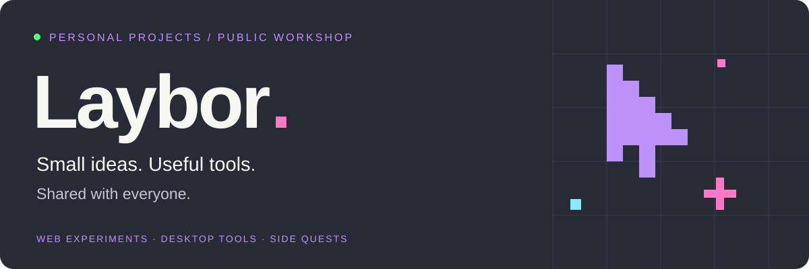
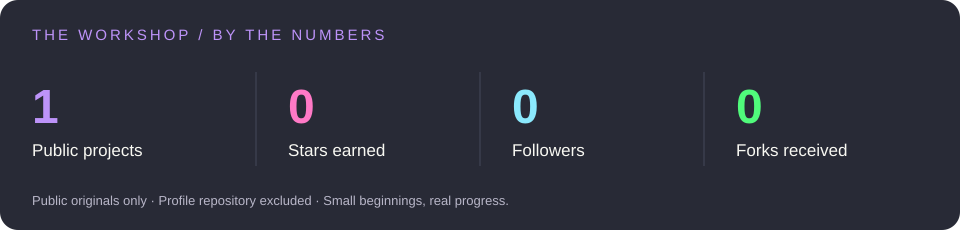
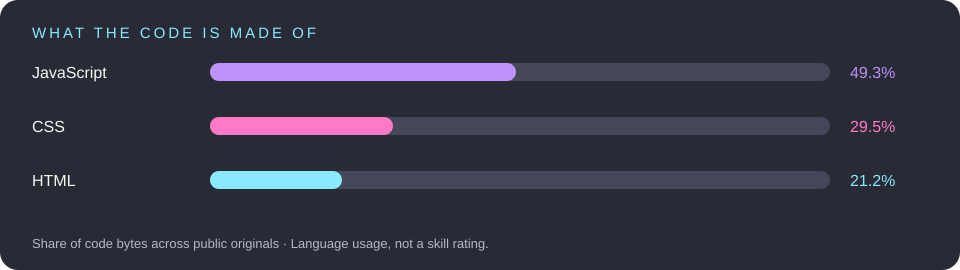

  
  

## Hey, I'm Sebastian. Online, I'm Laybor. 👋

I turn everyday annoyances and curious ideas into personal projects. **The goal? Build something useful enough that someone else wants to use it, too.**

🦇 Dracula theme enjoyer · 🎮 Video game lover · 🛠️ Learning by building

## My toolbox

<strong>Building for the web</strong>

<strong>Exploring desktop development</strong>

## On the workbench

**My files are a mess. So I'm building my first desktop app to help.**

Choose a folder → preview the plan → organize files → undo if needed.

`Getting started` · `Python + PySide6 + SQLite` · Repository and demo coming when public.

🧭 The first milestones

- [ ] Scan a folder and group files by type.
- [ ] Preview destinations before moving anything.
- [ ] Resolve duplicate names without overwriting.
- [ ] Keep a movement history and support undo.
- [ ] Publish an installable first version.

## Play with pixels

### 🎨 GridPaintingWeb

Choose a grid. Pick a color. Paint something.

A learning project based on existing code, with improvements and fixes by me. [Explore the code →](https://github.com/Laybor/GridPaintingWeb)

## The workshop in numbers

Real public data from GitHub, refreshed daily. Project metrics exclude forks and this profile repository.

## Feeding the contribution snake 🐍

A little arcade energy for the contribution graph. Generated from my GitHub contributions.

## Fresh from the workshop

<strong>📡 Recent project activity</strong>

Recent pushes to my own public projects. A push doesn't necessarily mean a finished release.

<!-- ACTIVITY:START -->
| Repository | Main language | Last push (UTC) |
| :--- | :--- | :--- |
| [GridPaintingWeb](https://github.com/Laybor/GridPaintingWeb) | JavaScript | 2024-10-12 |
<!-- ACTIVITY:END -->

<strong>🎮 Future side quests</strong>

- A shared-expense tracker that figures out who owes whom.
- A website and API uptime monitor.
- A maze game that visualizes pathfinding algorithms.

Ideas for another day. One useful first version at a time.

## Try it. Break it. Help improve it.

Found a bug or have an idea? Open an issue in the project's repository and tell me what you were trying to do.

Visual credits & how this profile works

Technology logos by [Skill Icons](https://github.com/tandpfun/skill-icons). Badges by [Shields.io](https://shields.io). Contribution animation by [Platane/snk](https://github.com/Platane/snk). Colors inspired by [Dracula](https://draculatheme.com/).

The banner, organizer concept and statistics cards are custom SVGs. Stats and language shares are generated from GitHub's public API; language shares measure code bytes, not expertise. The organizer illustration shows a planned flow, not a finished app. The daily workflow refreshes the cards, recent projects and contribution animation.

